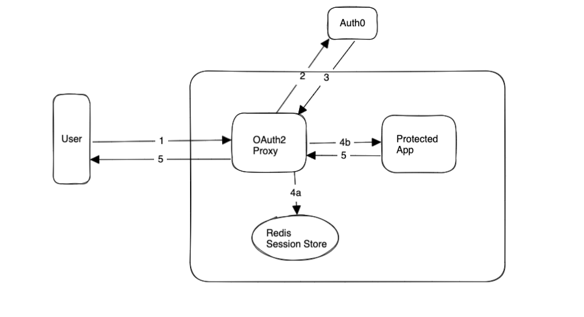
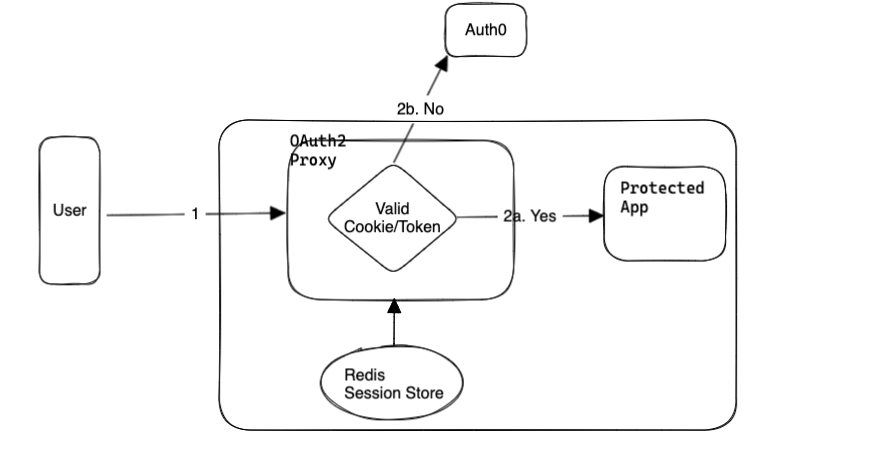
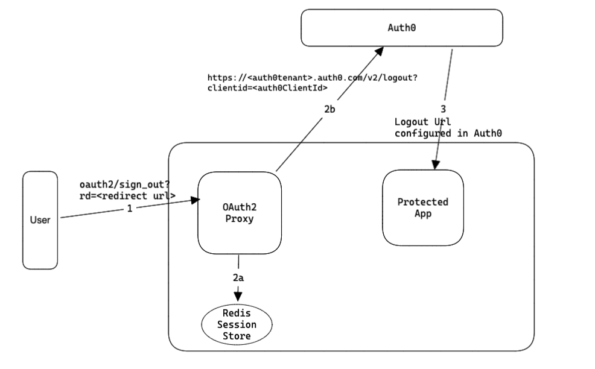
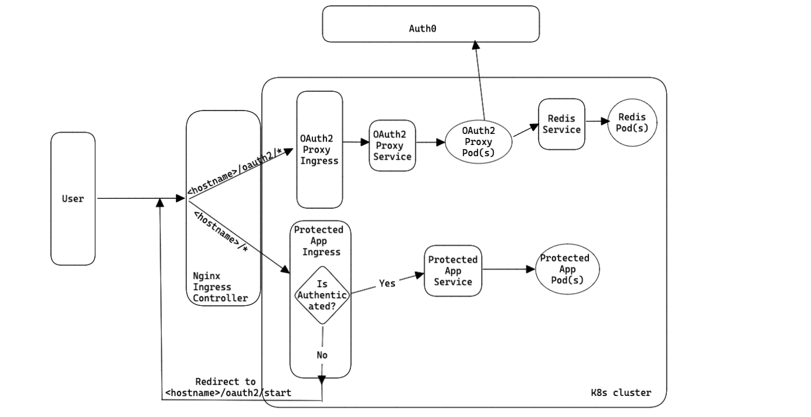

# oauth2-proxy-auth0

Working example for integrating OAuth2-Proxy with Auth0

- Protected App in the pictures below is a simple web application that needs to be protected with User Authentication
  - Sample Web Frontend built using React
  - Sample Web Backend built using [NestJS](https://docs.nestjs.com/)

## Running in Docker Compose

### Login Workflow



1. Unauthenticated User tries to access the protected app
2. The request goes through OAuth2-Proxy, which validates that the user is unauthenticated and redirects to Auth0 for login
3. Auth0 logs the user in, redirects the user back to `<hostname>/oauth2/callback` endpoint (exposed by OAuth2 Proxy)
4.
    a. OAuth2-Proxy gets hold of the IDToken returned by Auth0 , stores in the Redis Session Store and creates a session Cookie
    b. OAuth2-Proxy forwards the user request to the protected Application.
5. App returns the appropriate page that the user is browsing , in addition to the session cookie that OAuth2-Proxy has created.

### Post Login Workflow



1. After Login, all the subsequent requests will contain the session cookie.
2. OAuth2-Proxy uses this session cookie to identify , validity of the session and the token associated with the session.
    a. If invalid, either returns unauthorized or redirects the user to login again
    b. If Valid, forwards the request to the backend application

### Logout Workflow



1. Redirect to user to `<hostname>/oauth2/sign_out` endpoint (exposed by OAuth2-Proxy), with a redirect url in the query string
2. Any requests made to `oauth2/sign_out` endpoint will
    a. delete the session stored in the store
    b. if a redirect url is provided in the query string (should be html encoded) , OAuth2-Proxy will redirect the user to that redirect url as long as the hostname of the redirect is in whitelist domains configured on OAuth2-Proxy.

    ```
    // will log the user out of Auth0 app and redirect them to the logout url configured for that app in Auth0
    https://<auth0tenant>.auth0.com/v2/logout?clientid=<auth0ClientId>     
    ```
3. Will redirect the user to the logout url configured in the App registration for Auth0. If there are multiple logout urls configured, it will by default redirect to the first logout url in the list. For more options, read [here](https://auth0.com/docs/authenticate/login/logout/log-users-out-of-auth0)


## Running in K8s cluster with Nginx Ingress Controller



### Differences with Docker Compose

- The user doesn't directly browse to the OAuth2-Proxy hosted url, in fact we don't configure any backend app for OAuth2-Proxy.
- The OAuth2-Proxy ingress is configured to take any requests that has oauth2 in their request uri
- The Protected App Ingress is configured to take every other request.
- On the protected app ingress, these annotations `nginx.ingress.kubernetes.io/auth-signin` and `nginx.ingress.kubernetes.io/auth-url` are configured with '<hostname>/oauth2/start' and '<hostname>/oauth2/auth' urls respectively. These annotations will ensure, any unauthenticated request has to be redirected to OAuth2-Proxy ingress for authentication.